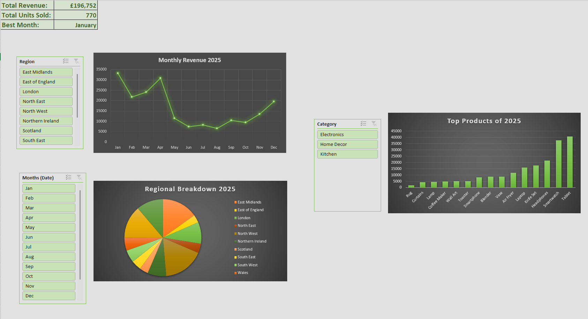
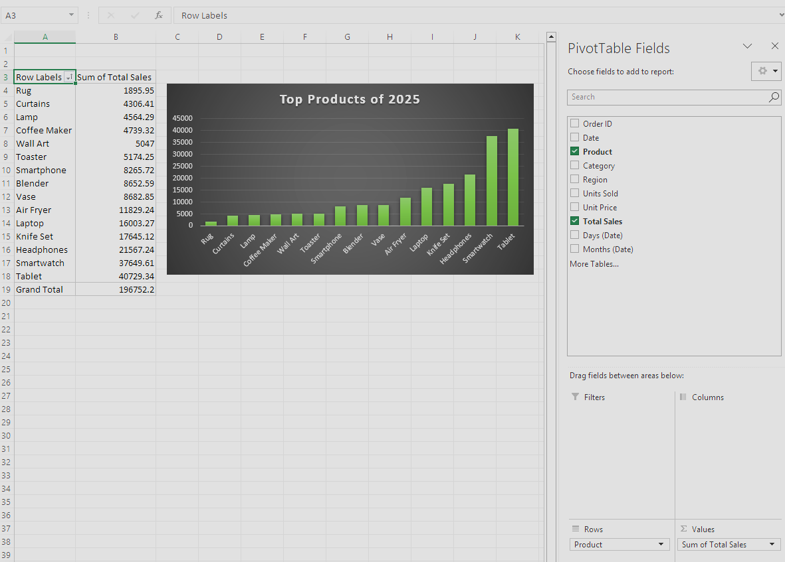
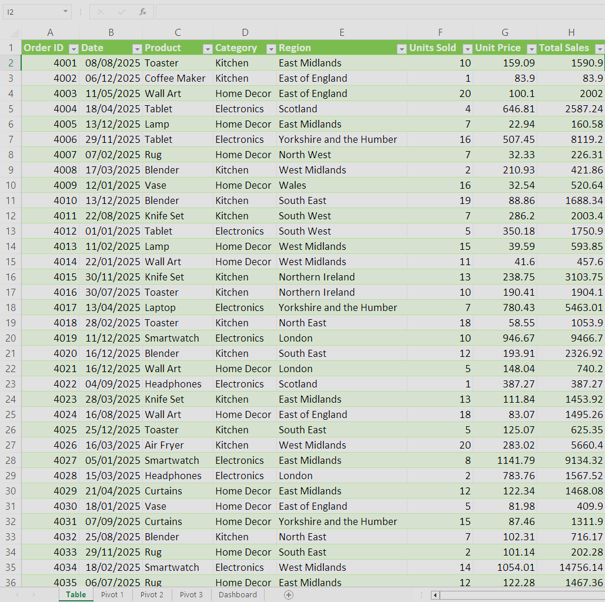
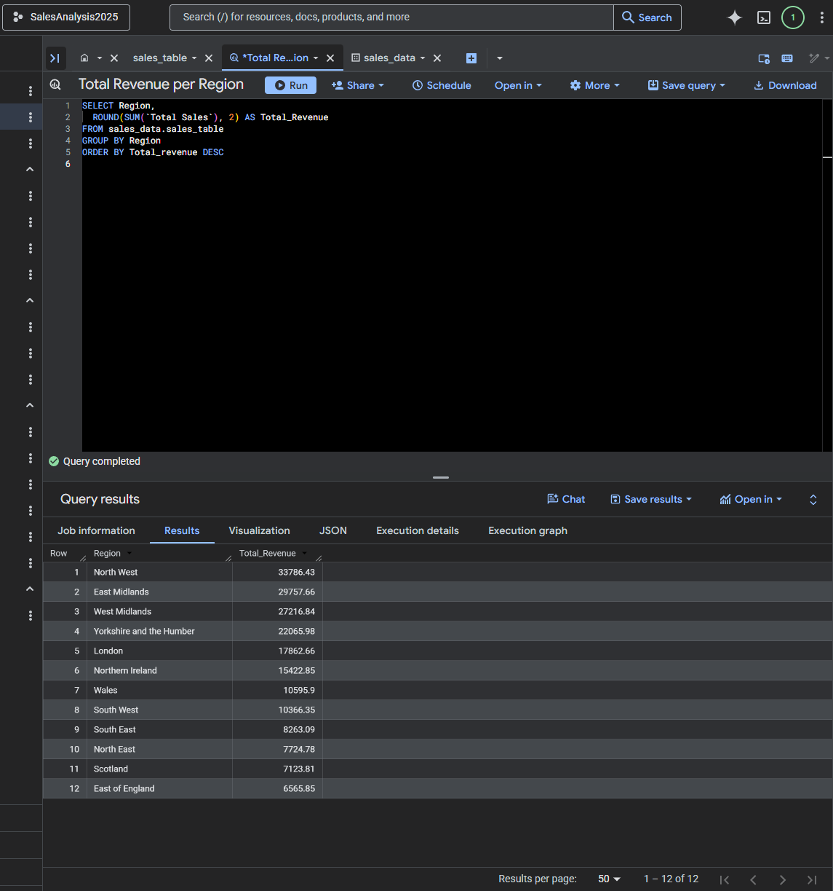
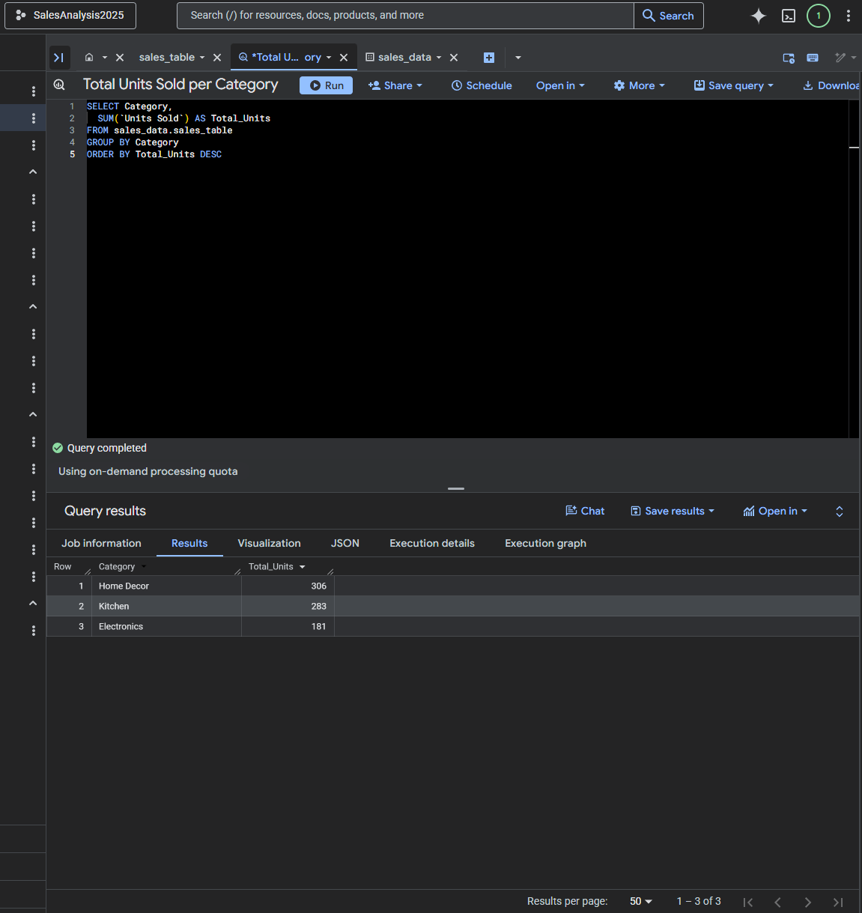
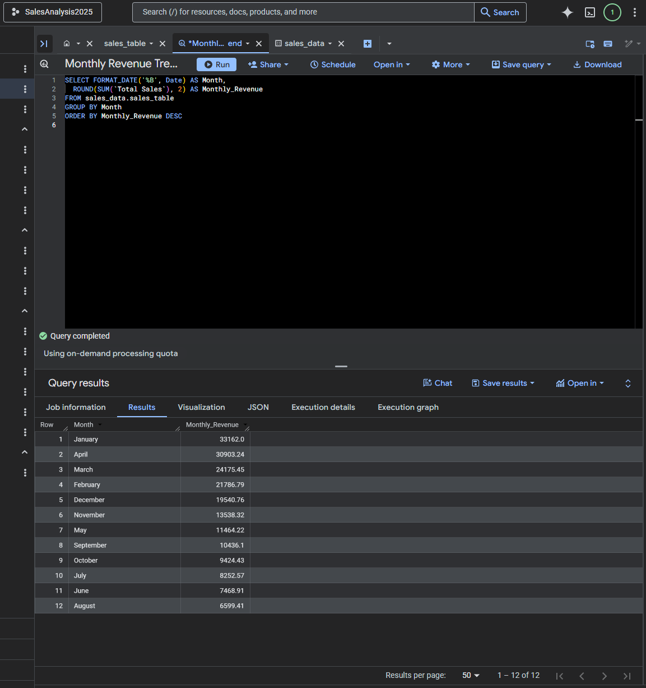
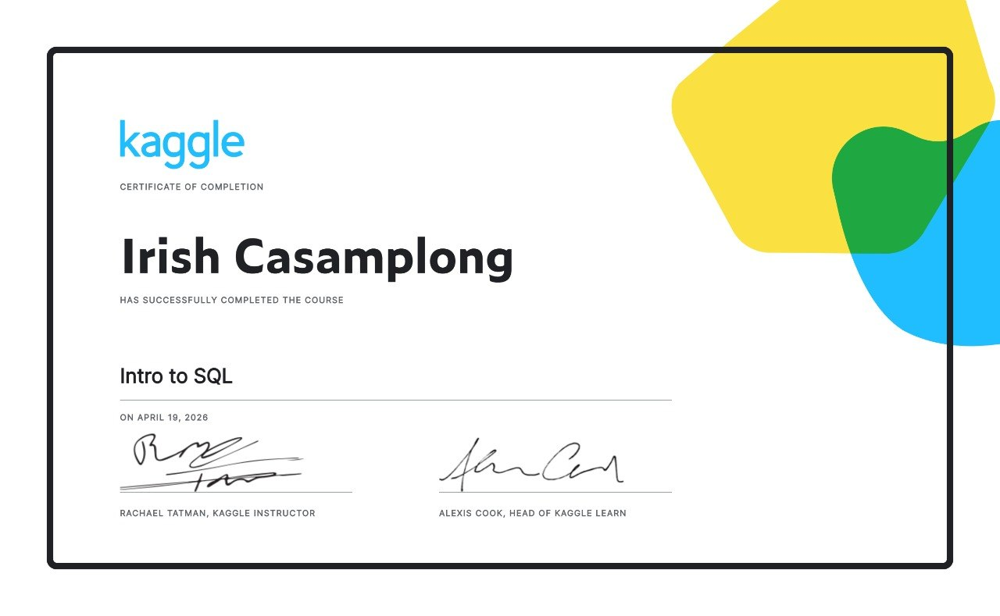

# Data Analysis Projects

A collection of small data projects using Excel and BigQuery SQL.

---

## Excel Sales Dashboard

Built a sample retail sales dataset in Excel and created an interactive 
dashboard with pivot charts, slicers and KPI summary cards to visualise 
sales performance across regions and categories.

**Tools used:** Excel, Pivot Tables, Charts, Slicers

---

## SQL Queries — BigQuery

Imported the same dataset into BigQuery and ran basic SQL queries 
to extract insights from the data.

Query 1 — Total Revenue per Region
- Calculates the total revenue generated by eaach region, ordered from highest to lowest.
- North West came out as the top performing ewgion with £33,786.43 in total revenue.

Query 2 — Total Units Sold per Category
- Breaks down the total number of units sold across each product category. 
- Home Decor was the most sold category with 306 units, followed by Kitchen (283) and Electronics (181).

Query 3 — Top 5 Best Selling Products
- Identifies the top 5 products by units sold. 
- Vase was the best selling product with 102 units, followed by Knife Set and Tablet.

Query 4 — Monthly Revenue Trend
- Extracts monthly revenue across the year to identify peak and low sales periods. 
- January was the highest revenue month at £33,162, while August was the lowest at £6,599.41.

Query 5 — Revenue and Units per Region and Category Combined
- An analysis combining region and category to find the most profitable combinations including average revenue per unit. North West Electronics ranked highest with £30,353 total revenue.

---

## Summary

This project involved analysing a sample UK retail sales dataset using both Excel and BigQuery SQL. 
The dataset contained sales transactions across multiple regions, product categories and months.

Key findings from the analysis:
- North West was the highest revenue region overall
- Home Decor was the most sold product category by units
- Vase was the single best selling product with 102 units sold
- January recorded the highest monthly revenue while August was the slowest month
- Electronics in North West generated the highest revenue when broken down by region and category

The Excel dashboard was built first to visualise the data interactively, then the same dataset 
was imported into BigQuery to explore and validate insights using SQL queries.

---

## Online Certifications

Intro to SQL - Kaggle

